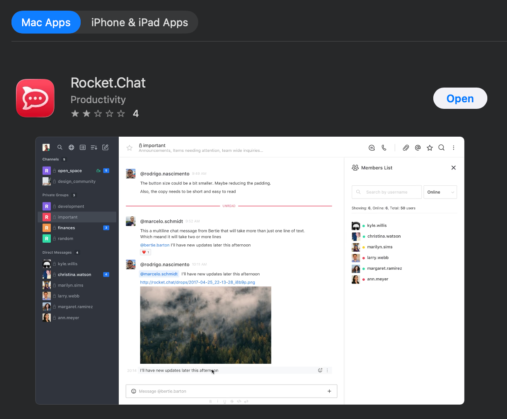
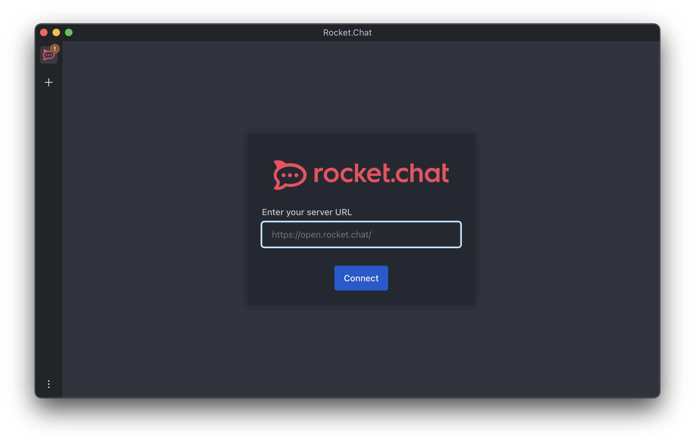
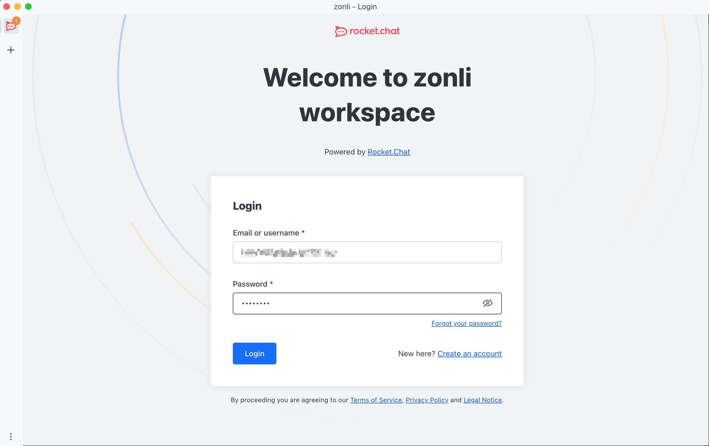
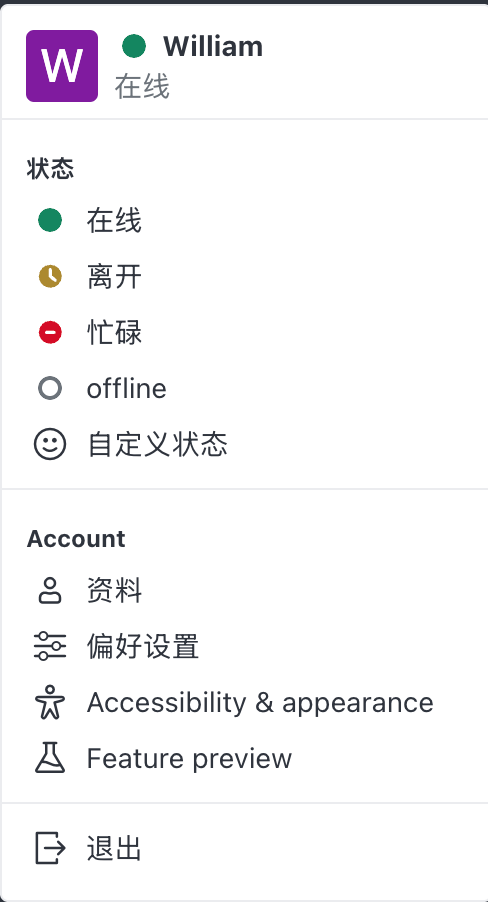

# MacOS
**最后更新日期**：
## 目录
[界面简介](#界面简介)
[安装及快速开始](#安装及快速开始)
[聊天功能](#聊天功能)
[视频功能](#视频功能)
[网盘功能](#网盘功能)

## 安装及快速开始
1. 在 App Store 中搜索 **Rocket.Chat** 选择Mac Apps,找到应用后点击安装（可能需要Apple ID密码）

2. 在系统中找到刚刚下载好的Rocket Chat应用并单击打开

3. 第一次登陆时候会要求提供服务器链接，输入提供的链接以连接公司服务器
（请联系公司技术人员获取链接）

4. 填入管理员提供的账户密码后点击登陆按钮

[当忘记密码时](#找回密码)       [新用户](#新用户)
## 界面简介
### 状态栏
|[用户头像 / 状态]()|[主页]()|[搜索]() |[通讯录]() |[显示方式]() |[新建聊天]() | [更多选项]()|
|-|-|-|-|-|-|-|

### 用户头像/状态

一、状态设置
*   🟢 在线：工作时间默认状态，表示可正常联系。
*   🟤 离开：临时离开工位，请在短时外出时设置。
*   🔴 忙碌：开会或专注工作时使用，避免打扰。
*   ⚪ 离线：下班或未登录系统。
*   🙂 自定义状态：可标注任务进展或临时说明，但请保持简洁专业。

二、账户设置
*   资料：填写或更新个人资料，请尽量保证资料完整。
*   偏好设置：根据个人习惯调整通知与界面
*   Accessibility & appearance：设置外观与无障碍
*   Feature preview：新功能尝新（不推荐使用，可能有不可预测的Bug）

三、退出
请**每次**使用 **退出** 功能在非公司设备上登出，确保信息安全

## 聊天功能

## 视频功能

## 网盘功能

## 设置开机启动

## 找回密码

## 新用户

## Q&A

